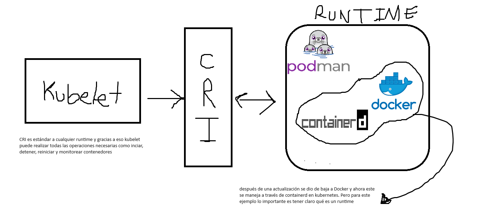

Docker es uno de los software mas populares para manejar contenedores. Sin embargo, debido a la especificidad de sus funciones, docker no fue diseñado para ser una solución enterprise ya que:

- Single host: Docker corre sobre un host, y sobre este monta los contenedores, lo cuál es un problema si hay un número de contenedores cuya ejecución supere los recursos del sistema. En este caso, linux evitará que se creen contenedores nuevos y tendremos problemas para que nuestra aplicación se ejecute correctamente
- No ofrece autoscalling: Al aumentar el tráfico que llega a nuestra aplicación, no hay manera de que docker pueda crecer automáticamente en recursos basado en condiciones específicas, por ejemplo, el uso de cpu o memoria en nuestra VPS 
- No ofrece autohealling: Al haber una señal negativa de healty en uno de nuestros contenedores, no hay manera de asegurar que el contenedor va a morir y se va a crear uno nuevo
- No ofrece los estándares enterprise: Docker está pensado para correr servicios de forma aislada (lo cual es muy bueno), pero debido a eso mismo se escapan los detalles de firewall, load balancing etc. Por lo cual, si necesitaramos crecer nuestra aplicación, la única manera sería incrementar los recursos del host, lo cual no es necesariamente lo mejor.

Todo esto está íntimamente relacionado con la arquitectura de microservicios. Imaginemos una aplicación que tiene un servidor de backend, uno de mensajes y uno de reportes. Si todos estuvieran en el mismo VPS estaríamos quemando dinero, ya que no necesariamente los tres servidores serían los responsables del consumo de CPU y memoria

Es por esto que tener los tres separados es clave, y aqui es donde kubernetes brilla. Si tenemos los tres separados, y el trafico aumenta en solo uno de ellos, lo lógico es que únicamente ese servicio sea el que debe crecer. Este simple hecho hace que cobre importancia y sentido el loadbalancing y el autoscalling. Nuesrto backend recibirá mucho mas tráfico que los otros dos servicios, entonces este será el que debe crecer.

# KUBELET

Kubernetes es una solución agnóstica del software de contenedores que se utilice, es decir, existen canitdad de soluciones alternativas a docker, y kubernetes funciona con cada una de ellas. 

Dicho esto, aquí entra el concepto de *container runtime*, y en terminos generales 

> Un runtime de contenedores es el software responsable de ejecutar los contenedores. Proporciona las funcionalidades básicas necesarias para crear, ejecutar y gestionar contenedores. Algunos ejemplos de runtimes de contenedores incluyen Docker, containerd y CRI-O. 

> En Kubernetes, el runtime de contenedores es una pieza clave del ecosistema, ya que es responsable de ejecutar los contenedores definidos en los Pods. Kubernetes utiliza la Container Runtime Interface (CRI) para interactuar con los runtimes de contenedores, lo que permite a Kubernetes soportar múltiples tipos de runtimes.

Dicho esto, es hora de introducir el concepto de *kubelet*. Kubelet es la pieza dentro de kubernetes que interactúa con el runtime de contenedores, *a través del CRI (container runtime interface)* la cuál es la pieza fundamental que permite utilziar cualquier runtime que se acomode a esta interfaz. 

Entonces kubelet una vez conectado podrá gestionar los contenedores, por ejemplo las tareas básicas como *iniciar, detener, reinciar y monitorear*, entre muchas otras cosas. Lo importante es enteder que kubelet se comunica con los contenedores y los gestiona (a traves del CRI)