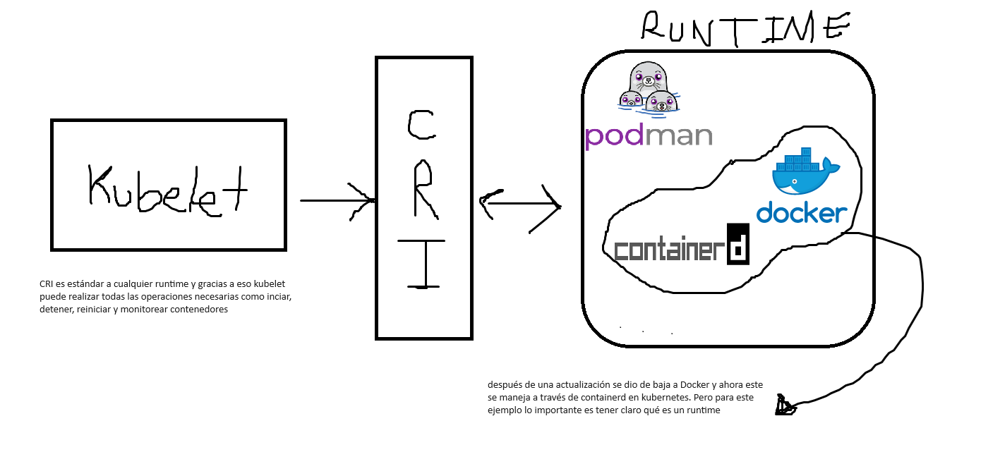

Docker es uno de los software mas populares para manejar contenedores. Sin embargo, debido a la especificidad de sus funciones, docker no fue diseñado para ser una solución enterprise ya que:

- Single host: Docker corre sobre un host, y sobre este monta los contenedores, lo cuál es un problema si hay un número de contenedores cuya ejecución supere los recursos del sistema. En este caso, linux evitará que se creen contenedores nuevos y tendremos problemas para que nuestra aplicación se ejecute correctamente
- No ofrece autoscalling: Al aumentar el tráfico que llega a nuestra aplicación, no hay manera de que docker pueda crecer automáticamente en recursos basado en condiciones específicas, por ejemplo, el uso de cpu o memoria en nuestra VPS 
- No ofrece autohealling: Al haber una señal negativa de healty en uno de nuestros contenedores, no hay manera de asegurar que el contenedor va a morir y se va a crear uno nuevo
- No ofrece los estándares enterprise: Docker está pensado para correr servicios de forma aislada (lo cual es muy bueno), pero debido a eso mismo se escapan los detalles de firewall, load balancing etc. Por lo cual, si necesitaramos crecer nuestra aplicación, la única manera sería incrementar los recursos del host, lo cual no es necesariamente lo mejor.

Todo esto está íntimamente relacionado con la arquitectura de microservicios. Imaginemos una aplicación que tiene un servidor de backend, uno de mensajes y uno de reportes. Si todos estuvieran en el mismo VPS estaríamos quemando dinero, ya que no necesariamente los tres servidores serían los responsables del consumo de CPU y memoria

Es por esto que tener los tres separados es clave, y aqui es donde kubernetes brilla. Si tenemos los tres separados, y el trafico aumenta en solo uno de ellos, lo lógico es que únicamente ese servicio sea el que debe crecer. Este simple hecho hace que cobre importancia y sentido el loadbalancing y el autoscalling. Nuesrto backend recibirá mucho mas tráfico que los otros dos servicios, entonces este será el que debe crecer.


# KUBELET


Kubernetes es una solución agnóstica al software de contenedores que se utilice, es decir, existen canitdad de soluciones alternativas a docker, y kubernetes funciona con cada una de ellas. 

Dicho esto, aquí entra el concepto de **container runtime**, y en terminos generales 

> Un runtime de contenedores es el software responsable de ejecutar los contenedores. Proporciona las funcionalidades básicas necesarias para crear, ejecutar y gestionar contenedores. Algunos ejemplos de runtimes de contenedores incluyen Docker, containerd y CRI-O. 

> En Kubernetes, el runtime de contenedores es una pieza clave del ecosistema, ya que es responsable de ejecutar los contenedores definidos en los Pods. Kubernetes utiliza la Container Runtime Interface (CRI) para interactuar con los runtimes de contenedores, lo que permite a Kubernetes soportar múltiples tipos de runtimes.

Dicho esto, es hora de introducir el concepto de **kubelet**. Kubelet es la pieza dentro de kubernetes que interactúa con el runtime de contenedores, **a través del CRI (container runtime interface)** la cuál es la pieza fundamental que permite utilziar cualquier runtime que se acomode a esta interfaz. 

"Kubelet es un agente que corre en cada nodo del clúster de Kubernetes y se asegura de que los contenedores estén corriendo en un Pod."

Enfatizar que Kubelet no sólo interactúa con el runtime, sino también aplica las configuraciones especificadas en los Pods.



Entonces kubelet una vez conectado podrá gestionar los contenedores, por ejemplo las tareas básicas como *iniciar, detener, reinciar y monitorear*, entre muchas otras cosas. Lo importante es enteder que kubelet se comunica con los contenedores y los gestiona (a traves del CRI)

# Pod

El siguiente paso lógico es analizar los Pods. Sabemos que kubelet tiene control sobre la gestión de los contenedores, pero ¿dónde están los contenedores?. Bueno, pues nada nuevo, el runtime se encarga de toda la operación sobre los contenedores, eso está claro. Lo importante es que kubernetes ahora es el que se encarga de gestionar las operaciones por medio de kubelet, y a su vez para darle contexto kubernetes agrupa los contenedores en Pods.

Un pod puede tener uno o varios contenedores, la documentación lo define como un "host lógico", algo así como tener un host de docker que corre unos contenedores cualquiera.

Algo **muy importante** es que los contenedores dentro de un pod comparten dirección Ip y puerto, y pueden encontrarse entre ellos a través de localhost.

También **importante** es que los contenedores dentro de un pod tienen acceso a volúmenes compartidos.

Ok, muy interesante. Ahora, recordando una vez mas que kubelet es el encargado de manejar los contenedores, y que kubernetes "asignará" los contenedores a algún Pod, veamos como es el proceso en su forma mas básica:

> kubectl apply -f https://k8s.io/examples/pods/simple-pod.yaml

Este lindo comando creará un pod simple con una imagen de nginx

```yaml
apiVersion: v1
kind: Pod
metadata:
  name: nginx
spec:
  containers:
  - name: nginx
    image: nginx:1.14.2
    ports:
    - containerPort: 80
```

Lo divertido es que **nunca crearemos los pods de esta manera** 🤣. Según la documentación "los pods están diseñados para ser relativamente efimeros" lo cual implica asumir una responsabilidad innecesaria al crearlos manualmente, ya que nos volveríamos locos para gestionar un cluster con una cantidad considerable de nodos.

Entonces como siempre, lo mejor es apuntar a la **simplicidad** y automatización. Por eso elegimos el enfoque **declarativo**, es decir, escrbiendo el comportamiento deseado en un bello archivo .yaml

### Pods Controllers

Aquí es donde viene algo llamado Pods Controllers. Y para no perder la cabeza, son simplemente **formas distintas de crear nuestros pods**. Kubernetes asumió el quebradero de cabeza y llegó a los siguientes controladores:

- **ReplicaSet**: Garantiza que un número específico de réplicas de un Pod esté en funcionamiento en todo momento. Si el número de réplicas cae por debajo del especificado, ReplicaSet crea automáticamente nuevos Pods para restaurar el número deseado.

- **Deployment**: Proporciona actualizaciones declarativas para tus aplicaciones, permitiendo realizar despliegues y rollbacks de manera controlada. Un Deployment administra un ReplicaSet subyacente para gestionar el número de réplicas de los Pods.

- **StatefulSet**: Proporciona garantías sobre el orden y la estabilidad de los Pods, especialmente en aplicaciones con estado como bases de datos. Cada Pod en un StatefulSet tiene un identificador único y un orden definido, lo que facilita la gestión de la persistencia de datos.

- **DaemonSet**: Garantiza que un Pod esté en funcionamiento en cada nodo del clúster (o en nodos seleccionados). Es útil para tareas como la recolección de logs o la supervisión del clúster.

- **Job y CronJob**: Ejecutan tareas de manera puntual o periódica. Los Jobs se utilizan para tareas que se ejecutan una sola vez, mientras que los CronJobs se utilizan para tareas que se ejecutan de forma periódica según un cronograma.


Evidentemente cada uno tiene sus casos de uso y especificidades, las cuales se interiorizarán con el tiempo y algo de sufrimiento. Luego veremos esto con mas detalle


# Kube proxy

Como mencionamos anteriormente, un pod puede albergar simultaneamente varios contenedores. Y a su vez varios pod pueden vivir en un mismo Nodo. Este escenario es el ideal para pensar en una red.

Algo **importante** que hay que recordar siempre, es que un pod puede entenderse como un **host virtual**, por lo que, los contenedores que vivan dentro de el van a compartir dirección IP. Esto significa que al igual que con docker, lo que hacemos es exponer algunos puertos para que puedan ser utilizados desde afuera del pod, pero conservando la misma dirección IP. Finalmente, para comunicar los contenedores dentro del pod se utiliza **localhost**.

Lo importante ahora es entender que **dentro del nodo vive kube proxy** el cual se encarga de mantener las funciones de red en los nodos, así como para los servicios que exponen estos Pods hacia el exterior.

- **Balaceo de Carga**: Kube-proxy gestiona el tráfico de red hacia los servicios expuestos por los Pods, distribuyendo de manera equitativa las solicitudes entrantes entre las réplicas de los Pods que forman el servicio.

- **Servicio de Proxy**: Actúa como un proxy de red para los servicios de Kubernetes, exponiendo una IP virtual única para cada servicio. Esto permite que los servicios sean accesibles de manera uniforme desde dentro y fuera del clúster.

- **Network Address Translation (NAT)**: Kube-proxy configura reglas NAT para redirigir el tráfico de red desde la IP virtual del servicio hacia las IP reales de los Pods que componen ese servicio.

- **Gestión de Servicios**: Asegura que los servicios estén disponibles y se comuniquen correctamente dentro del clúster, manteniendo la conectividad y la resolución de nombres de servicio.

# Ingress

Es la pieza responsable de manejar el acceso externo hacia nuestros servicios de kubernetes. En este punto es muy común ver a nginx para manejar el balanceo de carga externo, certificados SSL y routing basado en reglas específicas (entre muchas otras cosas, seguridad etc...)


# Worker node