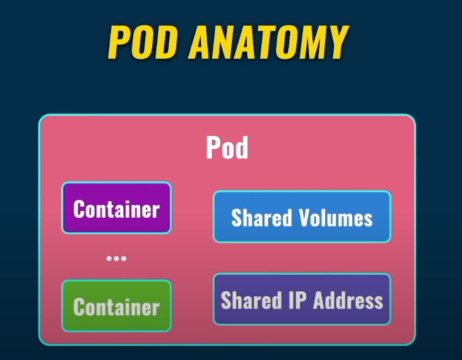
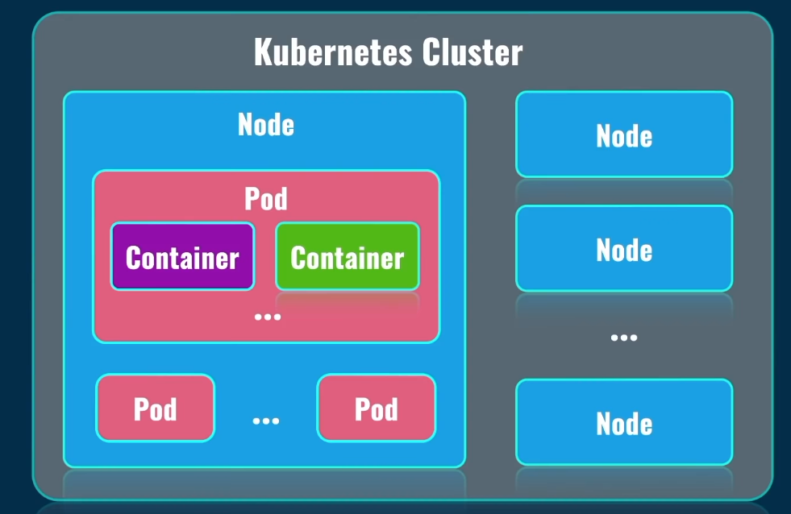
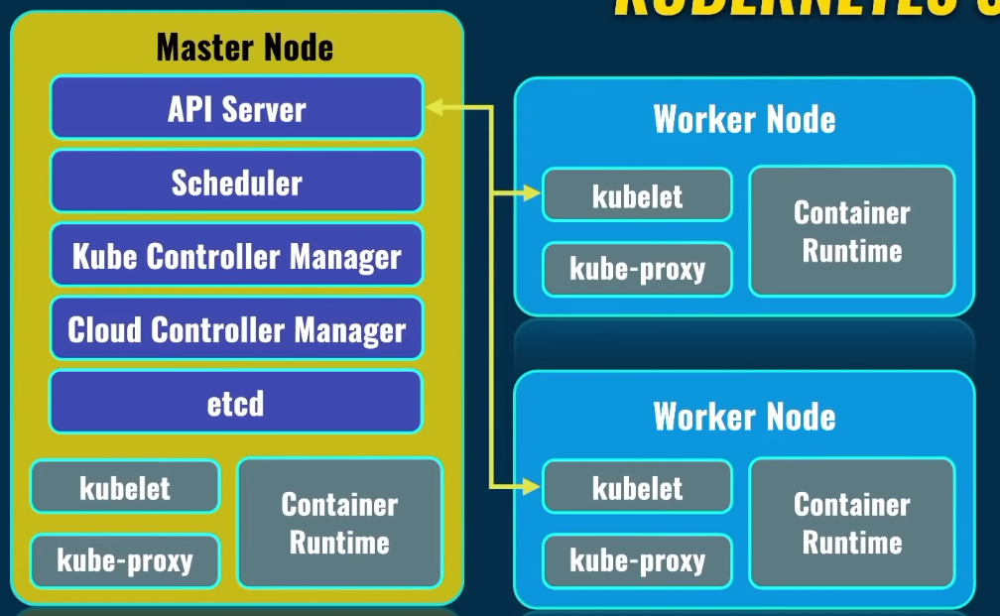

# Kubernetes (K8S)

> Es un sistema de orquestación de contenedores

Claramente es posible utilizar nuestro contenedor en cualquier máquina, pero si quisiéramos tener multiples contenedores **en diferentes máquinas/servidores** tendremos **problemas**.

Básicamente automatiza el deslpliegue de aplicaciones de contenedores a través de diferentes servidores. Cuidando la distribución de carga, auto-scaling, monitoring, health check, replacement etc.

--- 

# Terminología básica

### POD

Es la unidad mas pequeña en el mundo de kubernetes. **Lo normal es que haya solo un contenedor dentro del POD**, pero es posible tener varios.

Todos los contenedores que vivan dentro del un mismo POD van a tener volúmenes compartidos y recursos de red compartidos, tales como ip address.

Como es la unidad mas pequeña, un POD vive dentro de un servidor.

### Kubernetes cluster and Nodes

Un cluster es **un conjunto de nodos**

Un nodo es prácticamente un servidor, y se pueden incluir multiples servidores en el cluster, los cuales pueden estar esparcidos por todo el mundo.

Usualmente los nodos que están relacionados al cluster están alojados cerca para desempeñar las tareas mas eficientemente.

---

¿Cómo se comunican los nodos y se administran?

Bueno, existen varios tipos de Nodos

- Master Node: Administra los workers, distribuye carga. Este solo corre system PODs los cuales son responsables de funcionar el cluster en general
- Worker Node: Todo lo concerniente a nuestra aplicación se despliega en los worker

Ahora veamos los servicios que corren en cada nodo

- **Kubelet**: este servicio en cada worker node comunica con el API server del master node, ese servicio es el punto principal de comunicación entre nodos en el mundo de kubernetes 
- **kube-proxy**: es responsable de la comunicación de red en cada node y entre los diferentes nodos
- **container runtime**: Corre el contenedor en cada nodo (Docker, CRIO, ContainerD etc)

Estos tres servicios están presentes en cada los nodes

En el nodo maestro encontramos

- **api server**: (mencionado anteriormente)
- **scheduler**: es responsable de planear y distrubuir la carga entre diferentes nodos del cluster
- **kube controller manager**: Controla que pasa en cada nodo individual en el cluster
- **cloud controller manager**: Se encarga de gestionar el despliegue en cloud, sobre la forma en que se despliega la creación y la conexión entre los nodos. Aqui se tienen en cuenta la integración con los balanceadores de carga que ofrecen los cloud providers
- **etcd**: almacena key, values pairs. DNS. Almacena configuraciones para integrar diferentes despliegues con otros.

el comando `kubectl` nos permite conectarnos por medio de HTTPS al servicio **API Server** del nodo maerstro para gestionar el cluster.

Una de las cosas importantes es que los POD son efímeros y pueden ser eliminados o creados en cualquier momento y esto lo gestiona kubernetes automáticamente.

17:48