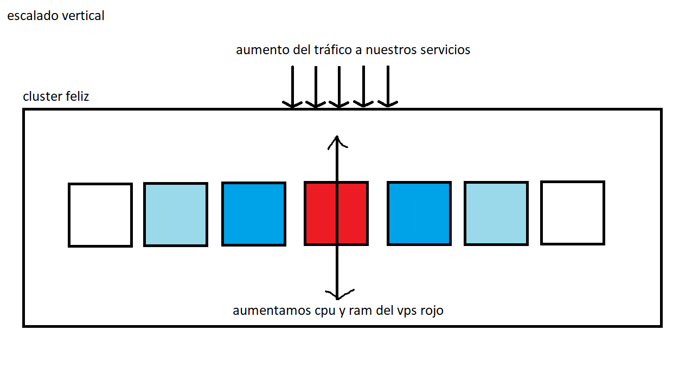
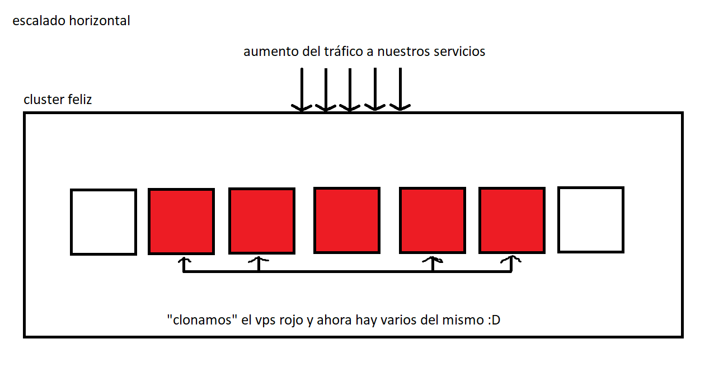

El escalado de recursos es uno de los elementos mas importantes en el mundo empresarial, porque siempre pensamos en el dinero. Si nuestra aplicación tiene bajo tráfico y de repente aumenta el numero de solicitudes, necesitamos que nuestro sistema tolere este aumento y siga funcionando. Es por esto que kubernetes (e incluso otras soluciones como AWS ECS) implmentan el escalado mediante la replicación.

Las métricas de recursos son fundamentales, tales como uso de CPU, RAM etc. Ya que basados en estas métricas nuestra configuración actuará y replicará nuestros servicios.

Hay dos tipos de escalado:

# Escalado Vertical

Este tipo de escalado se basa en el aumento de recursos de un nodo. Suponiendo el caso de un VPS, agregaríamos mas RAM y CPU para que este tenga mas poder de cómputo y nuestro servicio tenga mas espacio para ser ejecutado.

Si bien kubernetes no posee un escalado vertical automático, es posible configurar las características de los nodos manualmente

# Escalado Horizontal

Este tipo es el mas común y generalmente el mejor, ya que aún con varios vps de bajo costo podremos suplir nuestras necesidades. El truco es que nuestros pods se distribuirán en las diferentes replicas y mediante el mecanismo de load balancing nuestro servicio estará disponible

Es importante resaltar que es posible tener pods replicados en el mismo nodo dependiendo de la configuración **affinity y tolerations**

---

Un ejemplo divertido es pensar en una aplicación que lanzamos en un único nodo inicial. Resulta que no calculamos bien los recursos que esto iba a consumir y falla.

Tenemos ambas opciones aquí

- Aumentar los recursos del nodo inicial, de esta manera los servicios podrán iniciarse con tranquilidad, asumiendo los costos y los posibles problemas futuros, ya que al recibir mas tráfico indudablemente se va a colapsar nuevamente el vps
- Habilitar el escalado horizontal, de esta manera el servicio podra iniciar creando una réplica y estaremos bien.

# Métricas

Como se mencionó anteriormente la clave del funcionamiento del autoscalling son las métricas de los nodos. En AWS se utiliza el buen CloudWatch para obtener datos de EC2 sobre la RAM, CPU etc. 

Para hacer el simil entre ECS y Kubernetes, podemos comparar CloudWatch con HPA. Obtenemos los datos de los nodos y basados en las métricas replicamos los nodos según las necesidades.

Entonces en resumidas cuentas:

> Su objetivo principal es asegurar que la aplicación siempre tenga suficientes réplicas (instancias) en ejecución para manejar la carga de trabajo actual, garantizando al mismo tiempo que no haya recursos subutilizados que generen costos innecesarios.

### Funcionamiento de HPA:
1. Métricas de recursos: HPA utiliza métricas específicas para decidir cuándo escalar los pods. Las métricas más comunes son el uso de CPU y la utilización de memoria. Kubernetes monitoriza continuamente estas métricas en tiempo real.

2. Configuración de HPA: Para configurar el HPA, debes definir:
   - Métricas de autoscaling: Decide qué métricas (CPU, memoria u otras métricas personalizadas) se utilizarán para escalar.
   - Objetivos de uso de recursos: Establece los valores de utilización de recursos que deseas mantener (por ejemplo, mantener el uso de CPU en promedio al 50%).

3. Decisiones de escalado: Basado en las métricas configuradas, el HPA evalúa continuamente si hay necesidad de ajustar el número de réplicas de los pods.
   - Escalar hacia arriba: Si la carga aumenta y las métricas superan los límites definidos, el HPA incrementará el número de réplicas de los pods para manejar la carga adicional.
   - Escalar hacia abajo: Si la carga disminuye y las métricas caen por debajo de los límites establecidos, el HPA reducirá el número de réplicas, lo que ahorra recursos y costos.
   - Interacción con los controladores de réplicas: El HPA interactúa con los controladores de réplicas de Kubernetes para gestionar automáticamente el escalado de los pods. No es necesario intervenir manualmente una vez que se ha configurado correctamente.